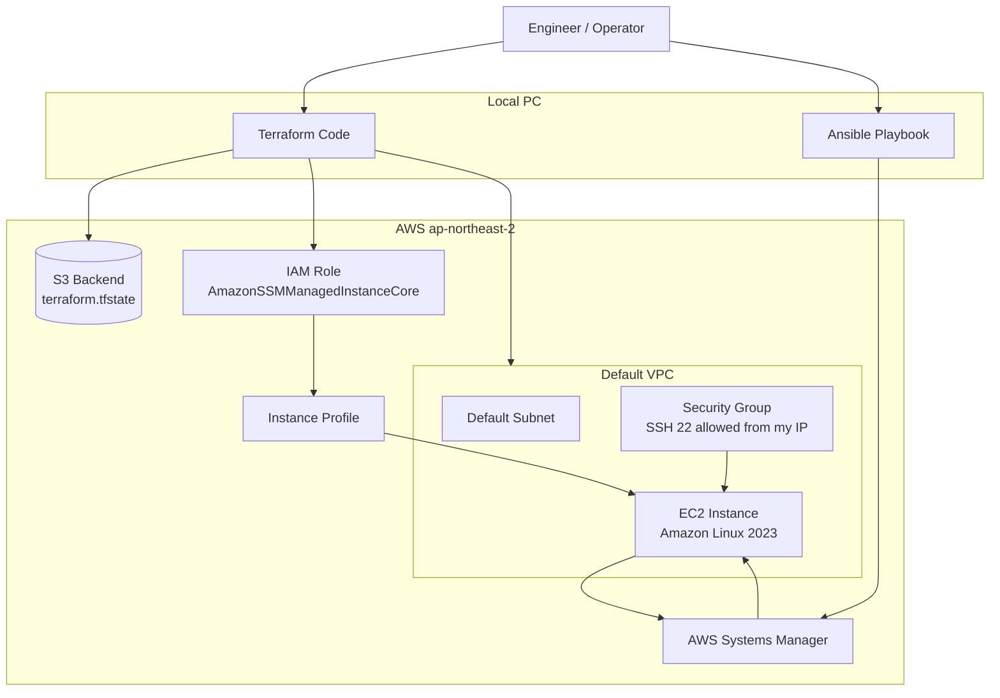

# Terraform EC2 Role Automation

AWS에 EC2 서버를 자동으로 만들고, 운영에 필요한 권한과 초기 설정까지 코드로 관리하는 실습 프로젝트입니다.

이 프로젝트는 AWS MSP 회사의 주니어 클라우드/인프라 엔지니어 관점에서 다음 역량을 보여줍니다.

- Terraform으로 AWS 인프라를 코드로 생성하는 능력
- EC2, Security Group, IAM Role, Instance Profile의 관계 이해
- SSM을 활용한 원격 운영 방식 이해
- Ansible을 통한 서버 초기 설정 자동화 경험
- Terraform state를 S3에 저장해 인프라 상태를 관리하는 방식 이해

## 아키텍처



## 전체 흐름

1. Terraform이 AWS Provider를 통해 서울 리전(`ap-northeast-2`)에 접속합니다.
2. 기본 VPC와 기본 Subnet을 조회합니다.
3. Amazon Linux 2023 최신 AMI를 조회합니다.
4. EC2 접속을 위한 Security Group을 생성합니다.
5. EC2가 AWS Systems Manager를 사용할 수 있도록 IAM Role을 생성합니다.
6. IAM Role을 Instance Profile에 연결합니다.
7. EC2 인스턴스를 생성하고 Security Group과 Instance Profile을 붙입니다.
8. Terraform 실행 결과로 VPC ID, Subnet ID, Security Group ID, EC2 ID, Public IP를 출력합니다.
9. Ansible은 SSM 연결 방식을 사용해 EC2에 접속합니다.
10. Ansible이 서버 패키지를 업데이트하고 `git`, `yum-utils`, `terraform`을 설치합니다.

## 주요 파일 설명

| 파일 | 역할 |
| --- | --- |
| `main.tf` | AWS Provider, S3 Backend, VPC/Subnet/AMI 조회, Security Group, EC2 생성 |
| `iam.tf` | EC2가 SSM을 사용할 수 있도록 IAM Role과 Instance Profile 생성 |
| `variables.tf` | 리전, 인스턴스 타입, 키 이름, SSH 허용 IP 같은 입력값 정의 |
| `terraform.tfvars` | 실제 적용할 변수값 설정 |
| `outputs.tf` | 생성된 인프라의 주요 결과값 출력 |
| `inventory.yml` | Ansible이 SSM을 통해 EC2에 접속하기 위한 인벤토리 |
| `playbook.yml` | EC2 내부 패키지 업데이트 및 Terraform 설치 자동화 |

## 핵심 개념

### Terraform

Terraform은 AWS 콘솔에서 수동으로 클릭해서 리소스를 만드는 대신, 코드에 적힌 내용대로 인프라를 생성하고 변경하는 도구입니다.

이 프로젝트에서는 Terraform으로 다음 리소스를 관리합니다.

- EC2 인스턴스
- Security Group
- IAM Role
- IAM Instance Profile
- S3 Backend 기반 Terraform state

### Terraform State

Terraform state는 "현재 AWS에 어떤 리소스가 만들어져 있는지"를 기록하는 파일입니다.

이 프로젝트는 state를 로컬 파일이 아니라 S3 버킷에 저장합니다. 실무에서는 여러 사람이 같은 인프라를 관리할 수 있어야 하므로, state를 중앙 저장소에 두는 방식이 중요합니다.

### Security Group

Security Group은 EC2 서버의 방화벽 역할을 합니다.

현재 구성은 SSH 22번 포트를 특정 IP 대역에서만 허용합니다. 모든 IP에 SSH를 열어두지 않고 접근 범위를 제한한다는 점에서 기본적인 보안 원칙을 반영합니다.

### IAM Role과 Instance Profile

EC2가 AWS 서비스를 사용하려면 권한이 필요합니다. 이 프로젝트에서는 EC2에 `AmazonSSMManagedInstanceCore` 정책이 연결된 IAM Role을 부여합니다.

Instance Profile은 IAM Role을 EC2에 붙이기 위한 AWS 리소스입니다. 즉, IAM Role은 권한이고 Instance Profile은 그 권한을 EC2에 전달하는 연결 장치라고 볼 수 있습니다.

### AWS Systems Manager

AWS Systems Manager, 줄여서 SSM은 EC2를 원격으로 관리할 수 있게 해주는 AWS 서비스입니다.

SSM을 사용하면 SSH 접속만 의존하지 않고도 서버에 명령을 실행하거나 운영 자동화를 구성할 수 있습니다. MSP 운영 환경에서는 고객 서버에 안전하게 접근하고 작업 이력을 관리하는 데 유용합니다.

### Ansible

Ansible은 서버 안에서 해야 하는 설정 작업을 자동화하는 도구입니다.

Terraform이 "AWS 리소스를 만드는 역할"이라면, Ansible은 "만들어진 서버 안에 필요한 패키지를 설치하고 설정하는 역할"입니다.

이 프로젝트의 Ansible Playbook은 다음 작업을 수행합니다.

- OS 패키지 업데이트
- `git` 설치
- `yum-utils` 설치
- HashiCorp yum repository 추가
- Terraform 설치

## 면접 설명 예시

이 프로젝트는 AWS에 EC2 서버를 수동으로 만드는 대신 Terraform 코드로 자동 생성하고, 생성된 서버에 SSM 접속 권한과 보안 그룹을 함께 구성한 프로젝트입니다.

`main.tf`에서는 AWS Provider와 S3 Backend를 설정하고, 기본 VPC와 Subnet, Amazon Linux 2023 AMI를 조회합니다. 이후 SSH 접근을 제한하는 Security Group을 만들고, EC2 인스턴스를 생성합니다.

`iam.tf`에서는 EC2가 AWS Systems Manager를 사용할 수 있도록 IAM Role을 만들고 `AmazonSSMManagedInstanceCore` 정책을 연결합니다. 이 Role은 Instance Profile을 통해 EC2에 부여됩니다.

서버가 생성된 뒤에는 Ansible을 사용해 SSM 방식으로 EC2에 접속하고, 패키지 업데이트와 Terraform 설치 같은 초기 설정을 자동화합니다.

따라서 이 프로젝트는 MSP 업무에서 중요한 인프라 표준화, 반복 배포, 접근 제어, 원격 운영 자동화의 기본 흐름을 실습한 것입니다.

## MSP 업무와의 연결

AWS MSP 회사는 고객사의 클라우드 환경을 대신 구축하고 운영합니다. 이 프로젝트는 그 업무 중 다음 영역과 연결됩니다.

- 고객 요청에 따라 EC2 기반 서버 환경을 빠르게 구성
- Security Group으로 접근 제어 적용
- IAM Role로 EC2 운영 권한 부여
- SSM 기반 원격 운영 환경 구성
- Terraform으로 인프라 변경 이력과 재현성 확보
- Ansible로 서버 초기 설정 표준화

실무에서는 여기에 모니터링, 백업, 비용 관리, 보안 점검, 장애 대응 절차가 추가됩니다.

## 실행 순서

Terraform 실행:

```bash
terraform init
terraform plan
terraform apply
```

Ansible 실행 예시:

```bash
ansible-playbook -i inventory.yml playbook.yml --extra-vars "instance_id=<EC2_INSTANCE_ID>"
```

인프라 삭제:

```bash
terraform destroy
```

## 주의할 점

- EC2, S3, 네트워크 사용량에 따라 AWS 비용이 발생할 수 있습니다.
- `terraform.tfvars`에는 실제 환경값이 들어가므로 공개 저장소에 올릴 때 주의해야 합니다.
- SSH 허용 IP는 필요한 범위로만 제한해야 합니다.
- S3 Backend 버킷은 미리 생성되어 있어야 합니다.
- Ansible SSM 연결을 사용하려면 로컬 환경에 필요한 AWS 인증과 Ansible SSM 관련 설정이 준비되어 있어야 합니다.

## 향후 개선 아이디어

- CloudWatch Agent 설치 및 로그 수집
- CPU, 메모리, 디스크 사용량 알람 구성
- EC2 태그 표준화
- SSM Session Manager 접속 절차 문서화
- AWS Backup 또는 EBS Snapshot 자동화
- 보안 그룹과 IAM 권한 최소화 점검
- Terraform module 구조로 리팩터링
- GitHub Actions로 Terraform plan 자동 검증
